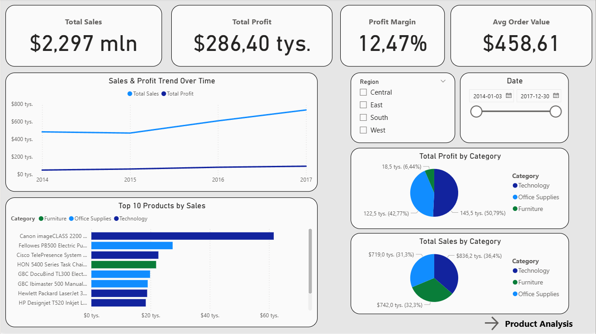
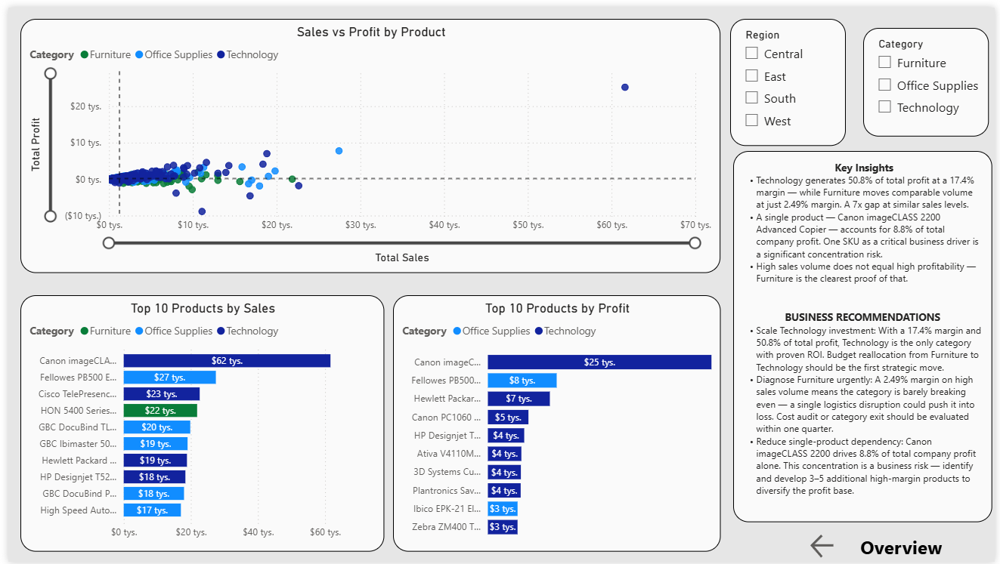

# Sales-Profit-Analysis-Power-BI-

EN Project Overview

This project analyzes sales and profitability across products and categories using Power BI.
The goal was to identify key revenue drivers, profitability patterns, and business optimization opportunities.

🇵🇱 Opis projektu

Projekt analizuje sprzedaż i rentowność produktów oraz kategorii w Power BI.
Celem było zidentyfikowanie kluczowych driverów biznesowych oraz obszarów optymalizacji.

⚙️ Data Preparation / Przygotowanie danych

EN:

Data cleaning and transformation
Creation of DAX measures (Sales, Profit, Margin)
Data modeling

PL:

Czyszczenie i transformacja danych
Tworzenie miar DAX (Sales, Profit, Margin)
Modelowanie danych
📊 Dashboard Features / Funkcjonalności

EN:

KPI: Total Sales, Total Profit, Profit Margin, Avg Order Value
Trend analysis (time series)
Category performance analysis
Top products by Sales and Profit
Product-level analysis (scatter plot: Sales vs Profit)

PL:

KPI: sprzedaż, zysk, marża, średnia wartość zamówienia
Analiza trendu w czasie
Analiza kategorii
Top produkty (sprzedaż i zysk)
Analiza produktów (scatter plot)

🔍 Key Insights / Kluczowe wnioski

EN:

Scale Technology investment: With a 17.4% margin and 50.8% of total profit, Technology is the only category with proven ROI. Budget reallocation from Furniture to Technology should be the first strategic move.

Diagnose Furniture urgently: A 2.49% margin on high sales volume means the category is barely breaking even — a single logistics disruption could push it into loss. Cost audit or category exit should be evaluated within one quarter.

Reduce single-product dependency: Canon imageCLASS 2200 drives 8.8% of total company profit alone. This concentration is a business risk — identify and develop 3–5 additional high-margin products to diversify the profit base.

Implement margin-first reporting: Replace revenue-focused KPI dashboards with margin-weighted views. Decisions based purely on sales volume — as Furniture demonstrates — can mask serious profitability problems.

PL:

Pilna diagnoza Furniture: Marża 2,49% przy wysokim wolumenie sprzedaży oznacza, że kategoria ledwo wychodzi na zero — jedno zakłócenie logistyczne może zepchnąć ją na stratę. W ciągu jednego kwartału należy przeprowadzić audyt kosztów lub rozważyć wyjście z kategorii.

Zmniejsz zależność od jednego produktu: Canon imageCLASS 2200 generuje samodzielnie 8,8% całego zysku firmy. To ryzyko koncentracji — zidentyfikuj i rozwiń 3–5 dodatkowych produktów o wysokiej marży, aby zdywersyfikować bazę zysku.

Zmniejsz zależność od jednego produktu: Canon imageCLASS 2200 generuje samodzielnie 8,8% całego zysku firmy. To ryzyko koncentracji — zidentyfikuj i rozwiń 3–5 dodatkowych produktów o wysokiej marży, aby zdywersyfikować bazę zysku.

Wprowadź raportowanie oparte na marży: Zastąp dashboardy skupione na przychodach widokami ważonymi marżą. Decyzje oparte wyłącznie na wolumenie sprzedaży — czego najlepszym dowodem jest Furniture — mogą maskować poważne problemy z rentownością.

----------------------------

🛠 Tools / Narzędzia
Power BI
DAX
📸 Dashboard Preview

    

🔗 [View Live Dashboard](https://app.powerbi.com/view?r=eyJrIjoiMzUyNTUyOWYtNWMyYS00MzQ2LWE4MmEtYWQzMTQxZTdmMDM4IiwidCI6ImU4MGE2MjdmLWVmOTQtNGFhOS04MmQ2LWM3ZWM5Y2ZjYTMyNCIsImMiOjh9)
